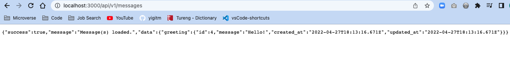
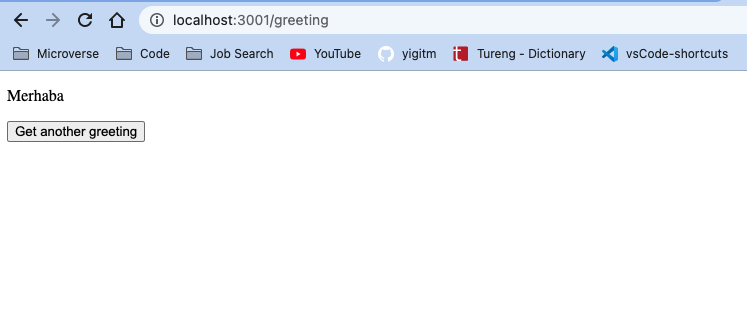

# Rails Backend

> This Rails API consists of implementing a connection between Ruby on Rails back-end and React front-end.
> Practicing the pros and cons with different approaches of connecting Ruby on Rails back-end with React front-end.



> It allows you to build React components as a part of your Rails JavaScript and serve it in a component, react_component, to be used in a regular ERB file by creating random greeting messages.

## React Frontend

[ React Frontend repository](https://github.com/yigitm/react-frontend/pull/1)



## Built With

- Ruby
- Rails
- React
- Redux
- Thunk
- Axios
- Rubocop

## Getting Started

To get a local copy up and running follow these simple example steps.

### Prerequisites

Ruby should be installed in your local machine. Please check this [article](https://www.theodinproject.com/lessons/ruby-installing-ruby) how to install/setup Ruby for different operating systems.

Ruby on Rails should be installed in your local machine. Please check this [article](https://www.theodinproject.com/lessons/ruby-on-rails-installing-rails) how to install/setup Ruby for different operating systems.

### Setup

To get a local copy of the repository please run the following commands on your terminal.

If you are not familiar to use terminal, please check this [article](https://www.theodinproject.com/courses/web-development-101/lessons/command-line-basics-web-development-101)

### Install

Open your terminal & go to your desktop.

```
cd your_desktop
```

Run below commands.

```
git clone https://github.com/yigitm/rails-backend.git
```

### Usage

Go to the app folder.

```
cd rails-backend
```

Run below command to install packages that app is depended to run.

```
bundle install
```

Run below to set database

```
rails db:create
rails db:migrate
rails db:seed
```

Run below for React packages

```
npm i
```

Run the local Rails server in your default browser with below command.

```
rails s
```

## Author

👤 **Yigit Mersin**

- GitHub: [@ygtmrsn](https://github.com/ygtmrsn)
- Twitter: [@ygtmrsn](https://twitter.com/ygtmrsn)
- LinkedIn: [yigitmersin](linkedin.com/in/yigitmersin)

## 🤝 Contributing

Contributions, issues, and feature requests are welcome!

Feel free to check the [issues page](https://github.com/yigitm/rails-backend/issues).

## Show your support

Give a ⭐️ if you like this project!

## Acknowledgments

- Microverse
- Open source

## 📝 License

Copyright (c) 2012-2022 Microverse

Permission is hereby granted, free of charge, to any person obtaining
a copy of this software and associated documentation files (the
"Software"), to deal in the Software without restriction, including
without limitation the rights to use, copy, modify, merge, publish,
distribute, sublicense, and/or sell copies of the Software, and to
permit persons to whom the Software is furnished to do so, subject to
the following conditions:

The above copyright notice and this permission notice shall be
included in all copies or substantial portions of the Software.

THE SOFTWARE IS PROVIDED "AS IS", WITHOUT WARRANTY OF ANY KIND,
EXPRESS OR IMPLIED, INCLUDING BUT NOT LIMITED TO THE WARRANTIES OF
MERCHANTABILITY, FITNESS FOR A PARTICULAR PURPOSE AND
NONINFRINGEMENT. IN NO EVENT SHALL THE AUTHORS OR COPYRIGHT HOLDERS BE
LIABLE FOR ANY CLAIM, DAMAGES OR OTHER LIABILITY, WHETHER IN AN ACTION
OF CONTRACT, TORT OR OTHERWISE, ARISING FROM, OUT OF OR IN CONNECTION
WITH THE SOFTWARE OR THE USE OR OTHER DEALINGS IN THE SOFTWARE.
